## Introduction 

Since its introduction, AWS Lambda's supported runtimes have continually expanded. Around 2020, support for containerized Lambdas was added. In this post, I'll walk you through the requirements for running Lambdas using images stored in ECR. I will cover scenarios where the ECR repository is in the same account, a more complex scenario with the repository in a different account, and a setup for larger organizations using AWS Organizations with multiple accounts organized into a hierarchy.

I will be strictly focusing on the permissions aspect. In my opinion, the official [AWS Documentation](https://docs.aws.amazon.com/lambda/latest/dg/images-create.html) is approachable and detailed enough with respect to the process of building container images for Lambdas, but it is somewhat scarce on the necessary permissions. Regardless of my opinion, [here's a link](https://docs.aws.amazon.com/lambda/latest/dg/images-create.html#gettingstarted-images-permissions) to the official documentation on the permissions aspect.

## Prerequisites

For the purposes of this blog post, I created two AWS Accounts. I am using AWS Organizations because it simplifies creating and cleaning up additional accounts. I also wanted to cover a multi-account setup with AWS Organizations, and we'll get to that in a later section of this post.

In one of the accounts, I created three ECR repositories:
- 813835382529.dkr.ecr.eu-central-1.amazonaws.com/lambda-same-account
- 813835382529.dkr.ecr.eu-central-1.amazonaws.com/lambda-another-account
- 813835382529.dkr.ecr.eu-central-1.amazonaws.com/lambda-aws-organizations

```mermaid
architecture-beta
    group org(aws:organizations)[Organization]

    group account1(aws:aws-account)[Account 1] in org
    group account2(aws:aws-account)[Account 2] in org

    service ecr(aws:elastic-container-registry)[ECR] in account1
    service lambda1(aws:lambda)[Lambda] in account1
    service lambda2(aws:lambda)[Lambda] in account2

    lambda1:B --> T:ecr
    lambda2:L --> R:ecr
```



Repository policies will be assigned to the ECR repositories according to the presented scenario.

I'm building and pushing the same container image to all these repositories. I chose Python and here's the sources if you wanted to reproduce my examples:

```python
# lambda_function.py

import sys
def handler(event, context):
    return 'Hello from AWS Lambda using Python' + sys.version + '!'
```

```Dockerfile
FROM public.ecr.aws/lambda/python:3.12

COPY lambda_function.py ${LAMBDA_TASK_ROOT}

CMD [ "lambda_function.handler" ]
```

Finally, here's how I build and push the image to the respective ECR repositories:
```shell
# build the image
$ docker build . --provenance=false \
-t 813835382529.dkr.ecr.eu-central-1.amazonaws.com/lambda-same-account:0.0.1 \
-t 813835382529.dkr.ecr.eu-central-1.amazonaws.com/lambda-another-account:0.0.1 \
-t 813835382529.dkr.ecr.eu-central-1.amazonaws.com/lambda-aws-organizations:0.0.1

# login to ECR
$ aws ecr get-login-password --region eu-central-1 | docker login --username AWS --password-stdin 813835382529.dkr.ecr.eu-central-1.amazonaws.com
# ... removed for brevity
Login Succeeded

# push the images
$ docker push 813835382529.dkr.ecr.eu-central-1.amazonaws.com/lambda-same-account:0.0.1
# ...
0.0.1: digest: sha256:d6e5cc55766f98a72111e769640d54ac83a201ff18cb40a2547055de7def5825 size: 1785

$ docker push 813835382529.dkr.ecr.eu-central-1.amazonaws.com/lambda-another-account:0.0.1 
# ...
0.0.1: digest: sha256:d6e5cc55766f98a72111e769640d54ac83a201ff18cb40a2547055de7def5825 size: 1785

$ docker push 813835382529.dkr.ecr.eu-central-1.amazonaws.com/lambda-aws-organizations:0.0.1
# ...
0.0.1: digest: sha256:d6e5cc55766f98a72111e769640d54ac83a201ff18cb40a2547055de7def5825 size: 1785
```

We can also verify that the image we've just built works by testing it locally:
```shell
$ docker run -d -p 9000:8080 813835382529.dkr.ecr.eu-central-1.amazonaws.com/lambda-same-account:0.0.1
94c8ffc1dc7dfe6e50d01fa8e43f429183c231a70b0c7ba7d83db484b4b24d4e
$ curl "http://localhost:9000/2015-03-31/functions/function/invocations" -d '{}'
"Hello from AWS Lambda using Python3.12.9 (main, Apr  9 2025, 10:25:36) [GCC 11.5.0 20240719 (Red Hat 11.5.0-5)]!"
```

LGTM. :)

In addition to the image, we'll also need an IAM Role for our Lambda. Here's how we can do that:
```shell
$ cat <<EOF > lambda-trust-policy.json
{
    "Version": "2012-10-17",
    "Statement": [
        {
            "Effect": "Allow",
            "Action": [
                "sts:AssumeRole"
            ],
            "Principal": {
                "Service": [
                    "lambda.amazonaws.com"
                ]
            }
        }
    ]
}
EOF

$ aws iam create-role --role-name LambdaRoleWithoutPermissions --assume-role-policy-document file://lambda-trust-policy.json
# ...
        "Arn": "arn:aws:iam::813835382529:role/LambdaRoleWithoutPermissions",
# ...
```

The Lambda role creation step must be repeated in the other account in multi-account scenarios.

## Lambda and ECR repository in the same account

```mermaid
architecture-beta

    group account1(aws:aws-account)[Account 1]

    service ecr(aws:elastic-container-registry)[ECR] in account1
    service lambda1(aws:lambda)[Lambda] in account1

    lambda1:R --> L:ecr
```



```shell
$ aws lambda create-function \
  --function-name test-same-account \
  --role "arn:aws:iam::813835382529:role/LambdaRoleWithoutPermissions" \
  --package-type Image \
  --code ImageUri=813835382529.dkr.ecr.eu-central-1.amazonaws.com/lambda-same-account:0.0.1
```

In my case, it worked because I was using a powerful role to create the Lambda, which had permissions to modify the ECR Repository policy. After inspecting the policies, I found this policy was automatically added to my ECR Repository:
```json
{
  "Statement":[
    {
      "Condition":{
        "StringLike":{
          "aws:sourceArn":"arn:aws:lambda:eu-central-1:813835382529:function:*"
        }
      },
      "Action":[
        "ecr:BatchGetImage",
        "ecr:DeleteRepositoryPolicy",
        "ecr:GetDownloadUrlForLayer",
        "ecr:GetRepositoryPolicy",
        "ecr:SetRepositoryPolicy"
      ],
      "Principal":{
        "Service":[
          "lambda.amazonaws.com"
        ]
      },
      "Effect":"Allow",
      "Sid":"LambdaECRImageRetrievalPolicy"
    }
  ],
  "Version":"2008-10-17"
}
```

If the principle of least privilege had been followed properly, and the role used to create the Lambda couldn't modify the ECR Repository's permissions, the Lambda creation would have failed. Let's test it. 

First, I've reset repository's permissions. Then, I created another IAM Role called `LimitedLambdaRole` and assigned the predefined `AWSLambda_FullAccess` policy, which didn't include any ECR permissions. Then, I switched the role and attempted to create the Lambda function again.

```shell
# switch role ([kudos to Nev from stackoverflow](https://stackoverflow.com/a/67636523))
$ export $(printf "AWS_ACCESS_KEY_ID=%s AWS_SECRET_ACCESS_KEY=%s AWS_SESSION_TOKEN=%s" \
  $(aws sts assume-role \
  --role-arn arn:aws:iam::813835382529:role/LimitedLambdaRole \
  --role-session-name Test \
  --query "Credentials.[AccessKeyId,SecretAccessKey,SessionToken]" \
  --output text))

# Confirm whoami
$ aws sts get-caller-identity
{
    "UserId": "AROA327C6N4AUOWAVWF2Y:Test",
    "Account": "813835382529",
    "Arn": "arn:aws:sts::813835382529:assumed-role/LimitedLambdaRole/Test"
}

# Create lambda
$ aws lambda create-function \
  --function-name test-same-account \
  --role "arn:aws:iam::813835382529:role/LambdaRoleWithoutPermissions" \
  --package-type Image \
  --code ImageUri=813835382529.dkr.ecr.eu-central-1.amazonaws.com/lambda-same-account:0.0.1

An error occurred (AccessDeniedException) when calling the CreateFunction operation: Lambda does not have permission to access the ECR image. Check the ECR permissions.
```

I love the fail-fast strategy implemented here by AWS. Nothing would be more annoying than finding out that the permissions are incorrect only after trying to run your function. ;)

Let's see if it will work again if the proper policy is assigned to the ECR repository. I am assigning the following policy to the `lambda-same-account` ECR repo.

```json
{
  "Version":"2012-10-17",
  "Statement":[
    {
      "Sid":"LambdaECRImageRetrievalPolicy",
      "Effect":"Allow",
      "Principal":{
        "Service":"lambda.amazonaws.com"
      },
      "Action":[
        "ecr:BatchGetImage",
        "ecr:GetDownloadUrlForLayer"
      ]
    }
  ]
}
```

... and attempting to create the Lambda again:

```shell
$ aws lambda create-function \
  --function-name test-same-account \
  --role "arn:aws:iam::813835382529:role/LambdaRoleWithoutPermissions" \
  --package-type Image \
  --code ImageUri=813835382529.dkr.ecr.eu-central-1.amazonaws.com/lambda-same-account:0.0.1
{
    "FunctionName": "test-same-account",
    "FunctionArn": "arn:aws:lambda:eu-central-1:813835382529:function:test-same-account",
    "Role": "arn:aws:iam::813835382529:role/LambdaRoleWithoutPermissions",
# ... removed for brevity

# test the lambda
$ aws lambda invoke --function-name test-same-account out && cat out
{
    "StatusCode": 200,
    "ExecutedVersion": "$LATEST"
}
Hello from AWS Lambda using Python3.12.9 (main, Apr  9 2025, 10:25:36) [GCC 11.5.0 20240719 (Red Hat 11.5.0-5)]!"
```

## Lambda and ECR repository in separate accounts

```mermaid
architecture-beta

    group account1(aws:aws-account)[Account 1]
    group account2(aws:aws-account)[Account 2]

    service ecr(aws:elastic-container-registry)[ECR] in account1
    service lambda2(aws:lambda)[Lambda] in account2

    lambda2:L --> R:ecr
```




We'll cover a scenario where ECR repository and Lambda are in two distinct accounts. We'll use `813835382529.dkr.ecr.eu-central-1.amazonaws.com/lambda-another-account:0.0.1` for a Lambda in the `592444418872` account.

Please note that an IAM Role for Lambda must be created. See [Prerequisites](#prerequisites) for more information. It is assumed below that such role is already created.

Let's try creating a Lambda and inspect the error message:
```shell
# Confirm we're on the right account
$ aws sts get-caller-identity | grep Account
     "Account": "592444418872",

# Attempt to create the lambda
$ aws lambda create-function \
  --function-name test-another-account \
  --role "arn:aws:iam::592444418872:role/LambdaRoleWithoutPermissions" \
  --package-type Image \
  --code ImageUri=813835382529.dkr.ecr.eu-central-1.amazonaws.com/lambda-another-account:0.0.1
An error occurred (AccessDeniedException) when calling the CreateFunction operation: Lambda does not have permission to access the ECR image. Check the ECR permissions.
```

As expected, Lambda creation failed. Let's fix it by attaching a correct policy to the ECR Repository in the account hosting it:

```json
{
  "Version":"2012-10-17",
  "Statement":[
    {
      "Sid":"CrossAccountPermission",
      "Effect":"Allow",
      "Action":[
        "ecr:BatchGetImage",
        "ecr:GetDownloadUrlForLayer"
      ],
      "Principal":{
        "AWS":"arn:aws:iam::592444418872:root"
      }
    },
    {
      "Sid":"LambdaECRImageCrossAccountRetrievalPolicy",
      "Effect":"Allow",
      "Action":[
        "ecr:BatchGetImage",
        "ecr:GetDownloadUrlForLayer"
      ],
      "Principal":{
        "Service":"lambda.amazonaws.com"
      },
      "Condition":{
        "StringLike":{
          "aws:SourceArn":"arn:aws:lambda:*:592444418872:function:*"
        }
      }
    }
  ]
}
```

... and try creating the Lambda again:

```shell
$ aws lambda create-function \
  --function-name test-another-account \
  --role "arn:aws:iam::592444418872:role/LambdaRoleWithoutPermissions" \
  --package-type Image \
  --code ImageUri=813835382529.dkr.ecr.eu-central-1.amazonaws.com/lambda-another-account:0.0.1
{
    "FunctionName": "test-another-account",
    "FunctionArn": "arn:aws:lambda:eu-central-1:592444418872:function:test-another-account",
    "Role": "arn:aws:iam::592444418872:role/LambdaRoleWithoutPermissions",
# ... removed for brevity

# Finally test it
$ aws lambda invoke --function-name test-another-account out && cat out
{    
    "StatusCode": 200,
    "ExecutedVersion": "$LATEST"
}
Hello from AWS Lambda using Python3.12.9 (main, Apr  9 2025, 10:25:36) [GCC 11.5.0 20240719 (Red Hat 11.5.0-5)]!"
```

## Lambda and ECR Repository in separate accounts, using AWS Organizations

```mermaid
architecture-beta
    group org(aws:organizations)[Organization]

    group account1(aws:aws-account)[Account 1] in org
    group account2(aws:aws-account)[Account 2] in org

    service ecr(aws:elastic-container-registry)[ECR] in account1
    service lambda2(aws:lambda)[Lambda] in account2

    lambda2:L --> R:ecr
```



Larger organizations often use multiple AWS accounts. Centralizing the ECR inventory in a single account is a viable strategy for managing images and other OCI artifacts. Specifying each account individually in the policies is not a scalable approach: with tens or hundreds of accounts, the policy would become excessively large. More importantly, adding or removing accounts would require updating the policies for all ECR repositories. Thankfully, we can write policies in a way to target all accounts belonging to our organization.

We're going to use the same two accounts as previously and the third ECR repository: `813835382529.dkr.ecr.eu-central-1.amazonaws.com/lambda-aws-organizations`. Both accounts belong to the same AWS Organization.

Let's try creating the Lambda to confirm policies are not set:

```shell
$ aws lambda create-function \
  --function-name test-organizations \
  --role "arn:aws:iam::592444418872:role/LambdaRoleWithoutPermissions" \
  --package-type Image \
  --code ImageUri=813835382529.dkr.ecr.eu-central-1.amazonaws.com/lambda-aws-organizations:0.0.1

An error occurred (AccessDeniedException) when calling the CreateFunction operation: Lambda does not have permission to access the ECR image. Check the ECR permissions.
```

There are conditions you can use to target accounts belonging to an organization, such as `aws:PrincipalOrgID` (to restrict which organizations can access the repository) and `aws:SourceOrgID` (to restrict AWS service calls, like Lambda, to originate from accounts within your organization). Alternatively, `aws:PrincipalOrgPaths` and `aws:SourceOrgPaths` can be used for more granular control based on Organizational Units (OUs).

Which should you use? `aws:PrincipalOrgID` (paired with `aws:SourceOrgID`) is suitable for targeting all accounts within your organization. `aws:PrincipalOrgPaths` (paired with `aws:SourceOrgPaths`) is useful for multi-level hierarchies where you want to share with a subset (e.g., an OU). A common scenario is setting up separate OUs for production and development accounts, allowing you to easily target all production or all non-production accounts.

Here's a sample policy using a combination of `aws:PrincipalOrgID` and `aws:SourceOrgID` conditions. Remember to replace `<YOUR_ORG_ID>` with your actual AWS Organization ID.

```json
{
  "Version":"2012-10-17",
  "Statement":[
    {
      "Condition":{
        "StringEquals":{
          "aws:PrincipalOrgID":"<YOUR_ORG_ID>"
        }
      },
      "Action":[
        "ecr:BatchGetImage",
        "ecr:GetDownloadUrlForLayer"
      ],
      "Principal":{
        "AWS":[
          "*"
        ]
      },
      "Effect":"Allow",
      "Sid":"CrossAccountPermission"
    },
    {
      "Condition":{
        "StringEquals":{
          "aws:SourceOrgID":"<YOUR_ORG_ID>"
        }
      },
      "Action":[
        "ecr:BatchGetImage",
        "ecr:GetDownloadUrlForLayer"
      ],
      "Principal":{
        "Service":[
          "lambda.amazonaws.com"
        ]
      },
      "Effect":"Allow",
      "Sid":"LambdaECRImageCrossAccountRetrievalPolicy"
    }
  ]
}
```

First, let's verify that an authorized IAM user/role from an account within the organization can pull the image:
```shell
$ aws ecr get-login-password --region eu-central-1 | docker login --username AWS --password-stdin 813835382529.dkr.ecr.eu-central-1.amazonaws.com
# ...
Login Succeeded

$ docker pull 813835382529.dkr.ecr.eu-central-1.amazonaws.com/lambda-aws-organizations:0.0.1
0.0.1: Pulling from lambda-aws-organizations
# ....
813835382529.dkr.ecr.eu-central-1.amazonaws.com/lambda-aws-organizations:0.0.1
```

Now, let's try creating a Lambda:
```shell
$ aws lambda create-function \
  --function-name test-organizations \
  --role "arn:aws:iam::592444418872:role/LambdaRoleWithoutPermissions" \
  --package-type Image \
  --code ImageUri=813835382529.dkr.ecr.eu-central-1.amazonaws.com/lambda-aws-organizations:0.0.1
# ...

# test
$ aws lambda invoke --function-name test-organizations out && cat out
{
    "StatusCode": 200,
    "ExecutedVersion": "$LATEST"
}
Hello from AWS Lambda using Python3.12.9 (main, Apr  9 2025, 10:25:36) [GCC 11.5.0 20240719 (Red Hat 11.5.0-5)]!"
```

Another way to structure the policy is by using `aws:PrincipalOrgPaths` and `aws:SourceOrgPaths`. Replace `<YOUR_ORG_PATH_PREFIX>` accordingly (example: `o-abcdef/*` or `o-abcdef/r-1234/ou-abcd-12345678/*`). You may provide more than one organization path here.

```json
{
  "Version":"2012-10-17",
  "Statement":[
    {
      "Condition":{
        "ForAnyValue:StringLike":{
          "aws:PrincipalOrgPaths":[
            "<YOUR_ORG_PATH_PREFIX>"
          ]
        }
      },
      "Action":[
        "ecr:BatchGetImage",
        "ecr:GetDownloadUrlForLayer"
      ],
      "Principal":{
        "AWS":[
          "*"
        ]
      },
      "Effect":"Allow",
      "Sid":"CrossAccountPermission"
    },
    {
      "Condition":{
        "ForAnyValue:StringLike":{
          "aws:SourceOrgPaths":[
            "<YOUR_ORG_PATH_PREFIX>"
          ]
        }
      },
      "Action":[
        "ecr:BatchGetImage",
        "ecr:GetDownloadUrlForLayer"
      ],
      "Principal":{
        "Service":[
          "lambda.amazonaws.com"
        ]
      },
      "Effect":"Allow",
      "Sid":"LambdaECRImageCrossAccountRetrievalPolicy"
    }
  ]
}
```

## Summary

We covered the configuration of ECR Repository permissions required for AWS Lambda across different scenarios, depending on the needs or complexity of the organization. Features AWS is offering for our disposal lets us write concise policies, even for complex organizational setups.

## References

- Create a Lambda function using a container image - https://docs.aws.amazon.com/lambda/latest/dg/images-create.html
- IAM policy - global condition context keys - https://docs.aws.amazon.com/IAM/latest/UserGuide/reference_policies_condition-keys.html
- IAM policy - Conditions - https://docs.aws.amazon.com/IAM/latest/UserGuide/reference_policies_elements_condition_operators.html
